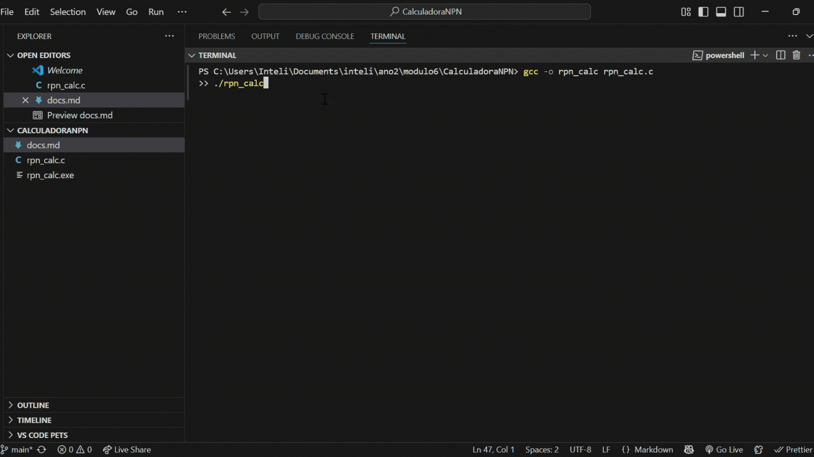

# 🧮 Calculadora em Notação Polonesa Reversa (RPN)

`Aluno: Davi Nascimento de Jesus` 

## 📋 Descrição da Atividade

&emsp;Este projeto consiste em uma calculadora em linguagem C que avalia expressões matemáticas escritas em **Notação Polonesa Reversa (RPN)**. A calculadora foi desenvolvida como parte de uma atividade de implementação do TAD Pilha. Essa foi a trilha escolhida, dentre as duas atividades propostas como opções das ponderadas

&emsp;A RPN (Reverse Polish Notation), ou notação pós-fixada, é uma forma de representar expressões matemáticas onde o operador vem **após** seus operandos, eliminando a necessidade de parênteses.

Exemplo:

(3 + 4) × 5 → RPN: 3 4 + 5 ×

É possível verificar o resultado dessa expressão no seguinte vídeo-demo:

<div align="center"> 
  <sub>Vídeo 1: Vídeo-demo do programa</sub><br/>
  <br/> 
  <sup>Fonte: Material produzido pelo autor (2025)</sup>
</div>

## 🏗️ Estrutura da Implementação

### TAD Pilha

A pilha foi implementada com as seguintes operações mínimas:

- `inicializaPilha()`
- `push(pilha, valor)`
- `valor = pop(pilha)`
- `estaVazia(pilha)`

### Funcionalidades

- Leitura de uma linha de texto representando a expressão RPN (via `fgets()`).
- Tokenização da expressão em números e operadores (`strtok()`).
- Avaliação da expressão utilizando exclusivamente o TAD Pilha para armazenar operandos.
- Suporte às operações básicas:
  - Adição `+`
  - Subtração `-`
  - Multiplicação `*`
  - Divisão `/`
- Exibição do resultado final na saída padrão.


## 🚀 Como Executar o Projeto

### 1️⃣ Compilação

No terminal (exemplo usando GCC):

```bash
gcc -o rpn_calc rpn_calc.c
```

### 2️⃣ Execução

```bash
./rpn_calc
```

### 3️⃣ Exemplo de Uso
```bash
Digite a expressao em RPN:
5 1 2 + 4 * + 3 -

Resultado: 14.00
```

## 🎯 Requisitos Atendidos

✅ Implementação do TAD Pilha<br/>
✅ Leitura e tokenização da expressão RPN<br/>
✅ Avaliação correta utilizando a pilha<br/>
✅ Suporte às quatro operações básicas<br/>
✅ Exibição correta do resultado final<br/>
✅ Tratamento de erros básicos (pilha vazia, divisão por zero, operadores inválidos)<br/>

